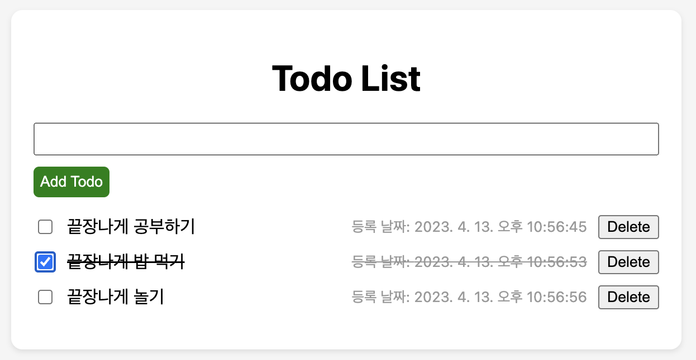
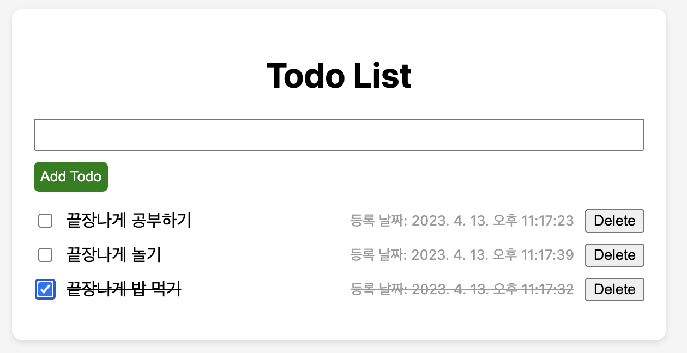

# 6주차 과제: Todo react app 수정해보기
---
## v.1.0

- 위의 이미지와 같이, 등록날짜가 표시되도록 관련 컴포넌트들을 수정하였습니다.
- 구글링 과정에서 계속해서 에러를 마주했고, 관련한 코드를 복사한 후, 해당 코드에서 어떤 기능을 추가하고 싶은지를 chatGPT에게 물어보며, 코드를 수정하였습니다.
- 버튼의 색 등 작은 css 수정이 있었습니다.
---
## v.1.1

- 완료된 아이템들이 아래로 정렬되도록 기능을 추가하였습니다.
- 정렬 메소드를 사용하여 completed 기준으로 정렬해준 뒤, 렌더링을 진행하도록 수정하였습니다.
